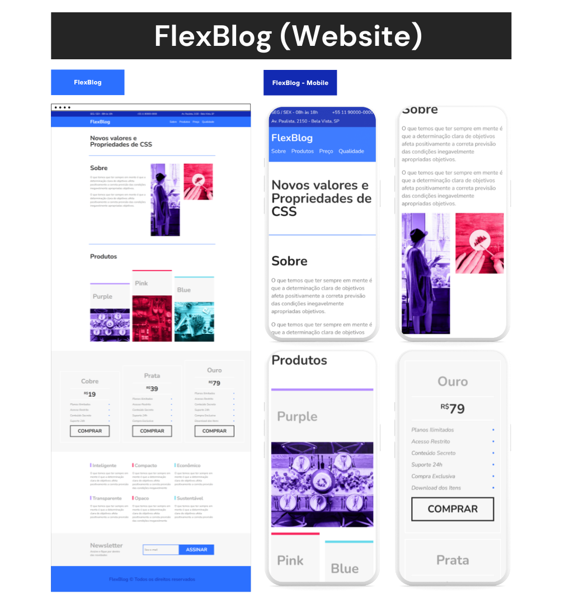

# FlexBlog

O FlexBlog foi desenvolvido durante o curso CSS Flexbox, da Origamid. Onde pude aprender
a criar layouts responsivos no CSS utilizando apenas as propriedades do flexbox.

Então criei o FlexBlog para colocar em prática os aprendizados do curso.

## 🛠️ Tecnologias

- CSS - Flexbox
- HTML

## 💙 Contato

joaoliveira.batista1@gmail.com
